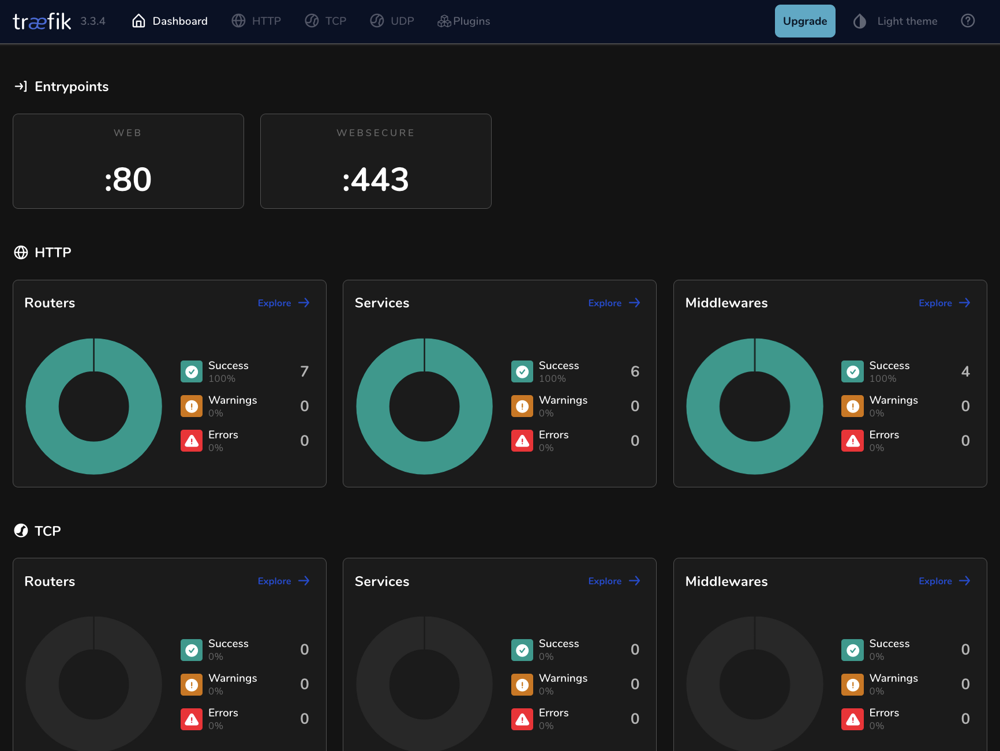
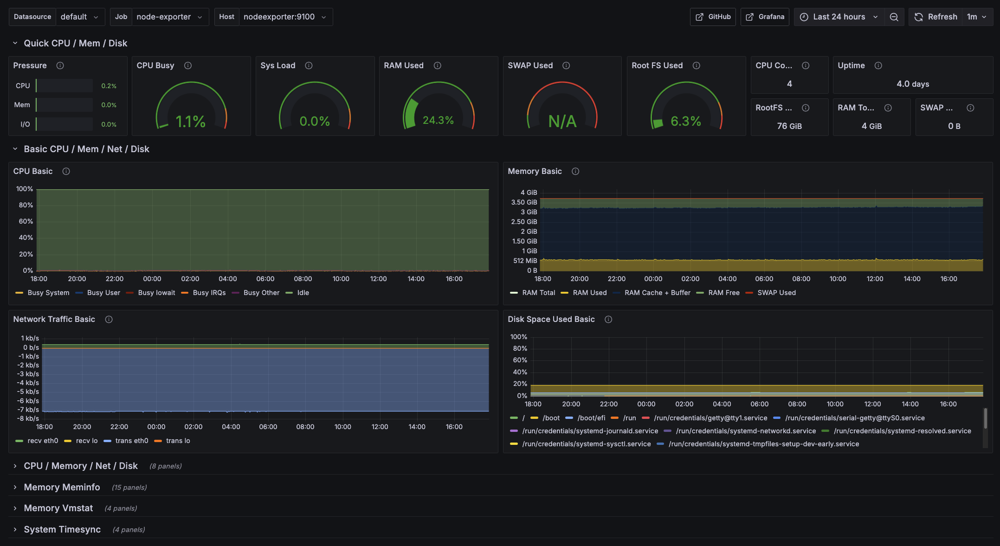

# Beavops 🦫


## About
Homelab insfrastructure stack making it trivial to deploy internet facing services

## Services 📦
- Traefik:
  - Configured with prebuilt middleware (located in `./traefik/dynamic`), such as rate limiting and simple authentication via labels.
  - Exposes Traefik admin dashboard.
  - Let's Encrypt HTTP challenge for TLS certificate provisioning.
  
  

- Observability:
  - Prometheus: Collects metrics from cAdvisor (containers) and Node Exporter (infrastructure).  
  - Grafana
  
  

- Umami Analytics:
  - Privacy-focused web analytics alternative to Google Analytics
  - Integrated with Traefik for SSL termination
  - PostgreSQL backend for data persistence
  - Self-hosted with full data ownership

---

## Getting Started 🚀
> [!important]
> The only required service needed to deploy your own containers to the internet is [traefik](./traefik) which acts as the reverse proxy, the rest of the stack is optional.
> Because of the way certificate challenges work, Traefik needs to be running and ready to respond to ACME challenges from Let's Encrypt. When services start, Traefik discovers them and initiates certificate requests, but Traefik itself must already be running to handle the challenge responses. Therefore, you want to start **Traefik first**, then start your other services.


1. Clone the Repository:
3. Create the traefik network : `docker network create traefik_public`
4. **Configure Environment Variables:**  
   - Duplicate the `env.example` files for each service to `.env`
   - Fill in information in each environment file.
     
---
     
### Traefik 🛫
1. Dashboard is exposed over internet, with the domain provided in `DASHBOARD_DOMAIN` environment var
2. Simple auth `DASHBOARD_AUTH_USERS` environment variable can be generated using [this script](./traefik/scripts/generate_simple_auth.sh)
3. Start with `docker compose up -d`

### Grafana Setup 📊

1. Launch the stack with Docker Compose: `docker compose up -d`.
3. Navigate to your Grafana URL (setted in the env file : `GRAFANA_DOMAIN`.
4. to connect, use the values specified in the env file : `GF_ADMIN_SECURITY_USER` and `GF_ADMIN_SECURITY_PASSWORD`.
5. Configure Data Source:
   - In the Grafana sidebar, click on **Configuration** (gear icon) and then **Data Sources**.
   - Click _Add data source_, choose _Prometheus_, and set the URL to `http://prometheus:9090`.
   - Click _Save & Test_.
6. Dashboard Setup (Optional):
   - Import pre-built dashboards by clicking the _+_ icon on the left sidebar and selecting _Import_.
> [!tip]
> You can use dashboard IDs from the [Grafana Dashboard Library](https://grafana.com/grafana/dashboards)

### TLS Configuration with Let’s Encrypt 🔒

1. **Traefik Integration:**  
   Traefik use Let’s Encrypt for TLS certificate provisioning.
   Replace the `ACME_EMAIL` placeholder inside [traefik static config file](./traefik/traefik.yaml).

3. **Certificate Resolver Configuration:**  
    Create the `acme.json` under `./traefik/data/` file
    ```sh
    mkdir ./traefik/data && touch ./traefik/data/acme.json
    chmod 600 ./traefik/data/acme.json
    ```
    On the traefik service launch, http challenge will be resolved


### What's up docker 🐋
The wud service need to be started : `docker compose up -d` in the service directory

> [!note]
> WUD is designed to update tool images automatically to reduce manual work.
> It is **not** intended to replace a continuous delivery pipeline!

### Umami Analytics 📊

1. **Environment Setup:**
   - Copy `.env.example` to `.env` in the `umami/` directory
   - Generate APP_SECRET: `openssl rand -hex 32`
   - Configure `UMAMI_DOMAIN` and `POSTGRES_PASSWORD`

2. **Deploy:** `docker compose up -d`

3. **First Login:**
   - Username: `admin`
   - Password: `umami`
   - Change default password immediately

4. **Add to Services:**
   ```html
   <script defer src="https://your-analytics-domain.com/script.js" data-website-id="your-website-id"></script>
   ```

## Your own Containers ! 
Add _Traefik_ essential labels to your containers, i writing inside a _docker compose_ file
```yaml
labels:
  - "traefik.enable=true"
  - "traefik.http.routers.SERVICE_NAME.rule=Host(`domain.com`)"
  - "traefik.http.routers.SERVICE_NAME.tls=true"
  - "traefik.http.routers.SERVICE_NAME.entrypoints=web,websecure"
  - "traefik.http.routers.SERVICE_NAME.tls.certresolver=letsencrypt"
  - "traefik.http.services.SERVICE_NAME.loadbalancer.server.port=PORT"
```

---

## Contributing

Contributions are welcome and appreciated! 🎉

If you have suggestions, ideas, or find any issues, feel free to open an issue or submit a pull request.
If you're not sure where to start, feel free to reach out or open a discussion.

## License 

This project is licensed under the MIT License - see the [LICENSE](LICENSE) file for details.
