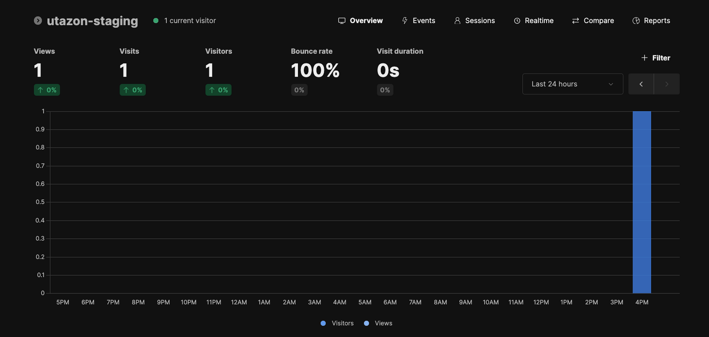

# Beavops 🦫


## About

Homelab insfrastructure stack making it trivial to deploy, monitor and manage containers to internet

## Services 📦

- **[Traefik](./traefik/README.md)** (Required):
  - Configured with prebuilt middleware (located in `./traefik/dynamic`), such as rate limiting and simple authentication via labels.
  - Exposes Traefik admin dashboard.
  - Let's Encrypt HTTP challenge for TLS certificate provisioning.

  

- **[Monitoring](./monitoring/README.md)** (Optional):
  - Prometheus: Collects metrics from cAdvisor (containers) and Node Exporter (infrastructure).
  - Grafana

  

- **[Umami Analytics](./umami/README.md)** (Optional):
  - Privacy-focused web analytics alternative to Google Analytics
  - Integrated with Traefik for SSL termination
  - PostgreSQL backend
  - Self-hosted with full data ownership

  

- **[What's up docker](./wud/README.md)** (Optional):
  - Dashboard to monitor availables container update, can be configured to send notifications or upgrade containers

---

## Getting Started 🚀

> [!important]
> The only required service needed to deploy your own containers to the internet is [traefik](./traefik) which acts as the reverse proxy, the rest of the stack is optional.
> Because of the way certificate challenges work, Traefik needs to be running and ready to respond to ACME challenges from Let's Encrypt. When services start, Traefik discovers them and initiates certificate requests, but Traefik itself must already be running to handle the challenge responses. Therefore, you want to start **Traefik first**, then start your other services.

1. Clone the Repository:
2. Create the traefik network : `docker network create traefik_public`
3. **Configure Environment Variables:**
   - Duplicate the `env.example` files for each service to `.env`
   - Fill in information in each environment file.

For detailed setup instructions for each service, refer to their individual README files:

- **[Traefik Setup](./traefik/README.md)** (Required)
- **[Monitoring Setup](./monitoring/README.md)** (Optional)
- **[Umami Analytics Setup](./umami/README.md)** (Optional)
- **[What's up docker Setup](./wud/README.md)** (Optional)

---

## Your own Containers

Add _Traefik_ essential labels to your container, i recomand using a _docker compose_ file

```yaml
labels:
  - "traefik.enable=true"
  - "traefik.http.routers.SERVICE_NAME.rule=Host(`domain.com`)"
  - "traefik.http.routers.SERVICE_NAME.tls=true"
  - "traefik.http.routers.SERVICE_NAME.entrypoints=web,websecure"
  - "traefik.http.routers.SERVICE_NAME.tls.certresolver=letsencrypt"
  - "traefik.http.services.SERVICE_NAME.loadbalancer.server.port=PORT"
```

---

## Contributing

Contributions are welcome and appreciated! 🎉

If you have suggestions, ideas, or find any issues, feel free to open an issue or submit a pull request.
If you're not sure where to start, feel free to reach out or open a discussion.

## License

This project is licensed under the MIT License - see the [LICENSE](LICENSE) file for details.
