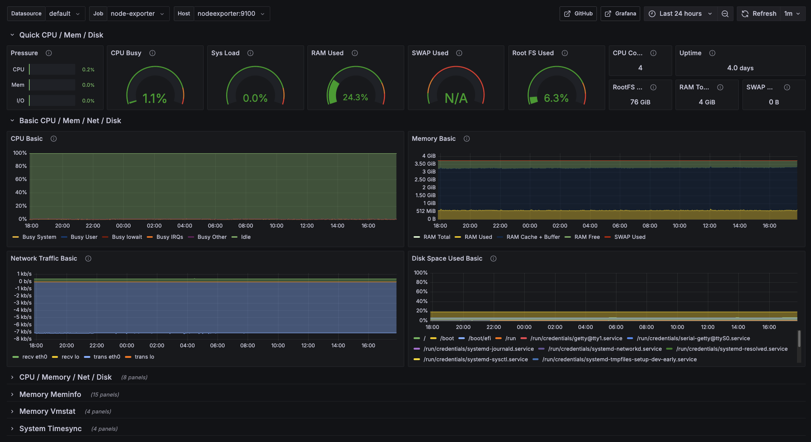

# Monitoring 📊

**Optional Service** - Observability stack with Prometheus and Grafana.

## About

- Prometheus: Collects metrics from cAdvisor (containers) and Node Exporter (infrastructure).  
- Grafana: Visualization and dashboards for metrics

## Setup

### Prerequisites

Traefik must be running first as it's mandatory for all services.

### Grafana Setup

1. **Configure Environment Variables:**  
   - Duplicate the `env.example` file to `.env`
   - Fill in information in the environment file.

2. Launch the stack with Docker Compose: `docker compose up -d`.

3. Navigate to your Grafana URL (setted in the env file : `GRAFANA_DOMAIN`.

4. to connect, use the values specified in the env file : `GF_ADMIN_SECURITY_USER` and `GF_ADMIN_SECURITY_PASSWORD`.

5. Configure Data Source:
   - In the Grafana sidebar, click on **Configuration** (gear icon) and then **Data Sources**.
   - Click _Add data source_, choose _Prometheus_, and set the URL to `http://prometheus:9090`.
   - Click _Save & Test_.

6. Dashboard Setup (Optional):
   - Import pre-built dashboards by clicking the _+_ icon on the left sidebar and selecting _Import_.

> [!tip]
> You can use dashboard IDs from the [Grafana Dashboard Library](https://grafana.com/grafana/dashboards)